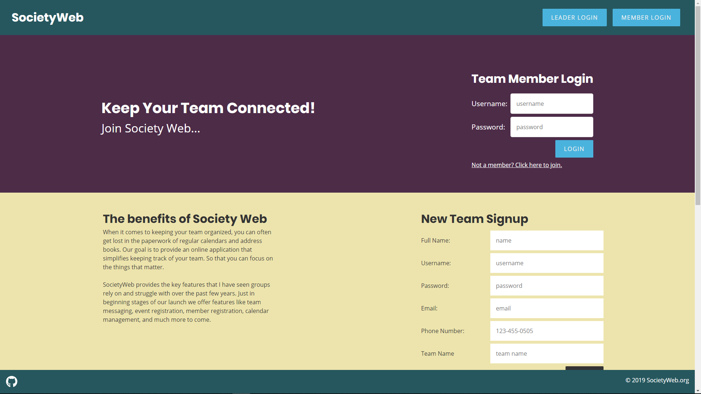
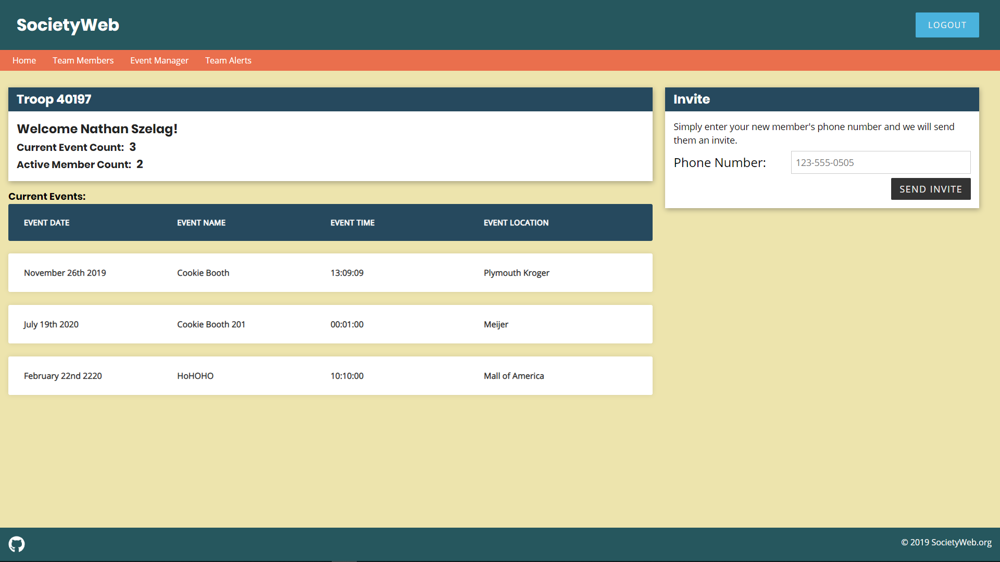
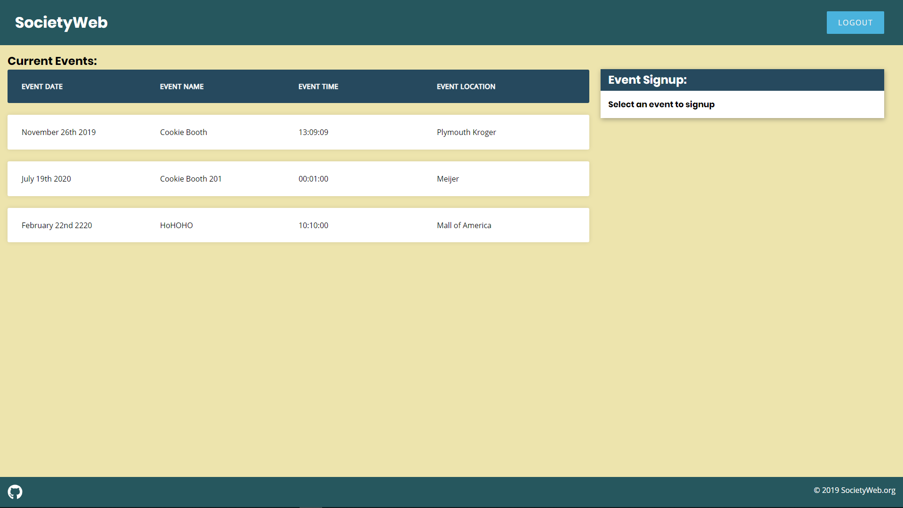

# SocietyWeb

[Live App](http://societyweb.surge.sh/)

When it comes to keeping your team organized, you can often get lost in the paperwork of regular calendars and address books.  Our goal is to provide an online application that simplifies keeping track of your team.  So that you can focus on the things that matter.

SocietyWeb provides the key features that I have seen groups rely on and struggle with over the past few years.  Just in beginning stages of our launch we offer features like team messaging, event registration, member registration, calendar management, and much more to come.

> To view the server for SocietyWeb [here](https://github.com/Nathan3p0/societyweb-server)

## Team

  - __Project Manager__: Nathan Szelag
  - __Design Lead__: Nathan Szelag
  - __QA Lead__: Nathan Szelag

## Table of Contents

1. [Usage](#Usage)
    1. [Team Member](#TeamMember)
    1. [Team Leader](#TeamLeader)
1. [Technologies](#Technologies)
1. [Team](#team)
1. [Contributing](#contributing)

## Usage
### TeamMember
> - Login with demo user name: **demoMember** and password: **Password.**
> - Once logged-in you will be taken to the dashboard page.
> - You will have the option to view events and RSVP to events listed.
### TeamLeader
> - Login with demo user name: **demoAdmin** and password: **Password.**
> - Once logged-in you will be taken to the dashboard page.
> - Click on the navigation at the top to choose what feature to use.

## Technologies

- React
- HTML
- CSS
- Node
- Express
- PostgreSQL
- Mocha/Chai/Jest
- Twilio API
- Heroku
- Surge

## Contributing

See [CONTRIBUTING.md](https://github.com/) for contribution guidelines.